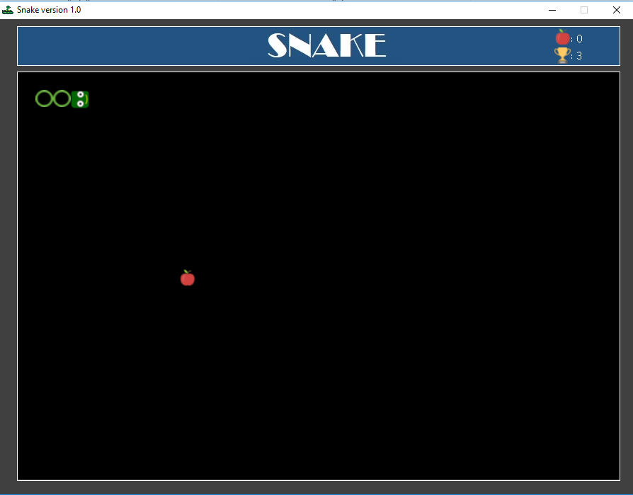

# Snake2DGame
Snake2DGame is a simple JFrame game.

## Table of contents
* [General info](#general-info)
* [Screenshots](#screenshots)
* [Technologies](#technologies)
* [Status](#status)
* [Contact](#contact)

## General info
I decided to create this application to learn something about JFrame and I was inspired by Awais Mirza's tutorial

## Screenshots

## Technologies
* Java 8
* JFrame

## Status
Project is: _finished_

## Contact
Created by [@Paweł_Łukaszewski](https://www.linkedin.com/in/paweł-łukaszewski) - feel free to contact me!
